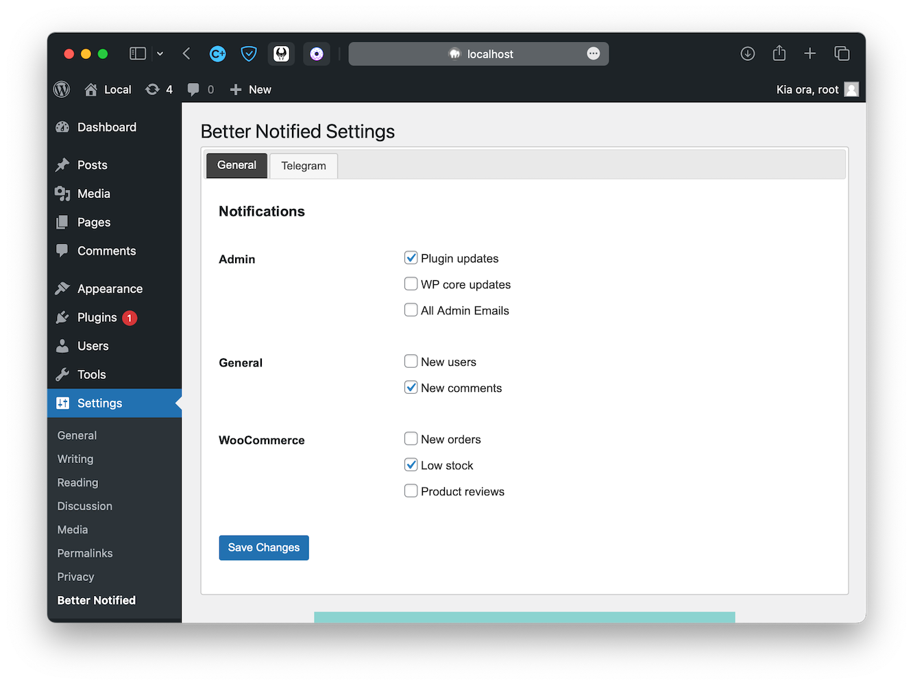

# Better Notified 🔔

   <a target="_blank" href="https://github.com/Reupenny/Better-Notified">

A Wordpress plugin to keep you notified of the important things.

Better Notified helps you stay informed about important events on your website. This plugin allows you to receive notifications about failed emails, new user registrations, plugin updates, core updates, and new comments in real-time through Telegram.

Please note this is my first plugin for wordpress and I am new to PHP.

## Features

🔹 Failed email notifications:
Get notified immediately when an email fails to send.

🔹 New user registration notifications:
Be informed when a new user registers on your website.

🔹 Plugin update notifications:
Stay up-to-date with the latest plugin versions and ensure the security of your website.

🔹 Core update notifications:
Keep track of Wordpress updates and make sure your website is always running the latest version.

🔹 Comments notifications:
Stay informed about new comments on your website.

🔹 Plugin Update Checker is being used to push updates.

    

## To Do List for V1 Release

🔲 Create a multisite instance

🔲 Add setting toggle to disable emails for selected notifications

🔲 Add setting toggle to enable/disable silent notifications

🔲 Add Woocommerce intergration, new orders, reviews

🔲 Create uninstall.php

## Complete

🟩 Add options in settings to disable and enable each notification type.

🟩 Seperate out the single PHP file into different files such as a setting.php.

## Version 2

🔲 Add Discord, Slack, Pushover, Gotify Notification Options

🔲 Allow users to add there own notification service instead of emails
    changeable in user settings and also via a shortcode to be accessable on the front end

## Version 3

🔲 Intergrate licencing to unlock new features that are added with version 3.

🔲 Add a notification center to hide all the annoying notifications that clutter the admin dashboard.
