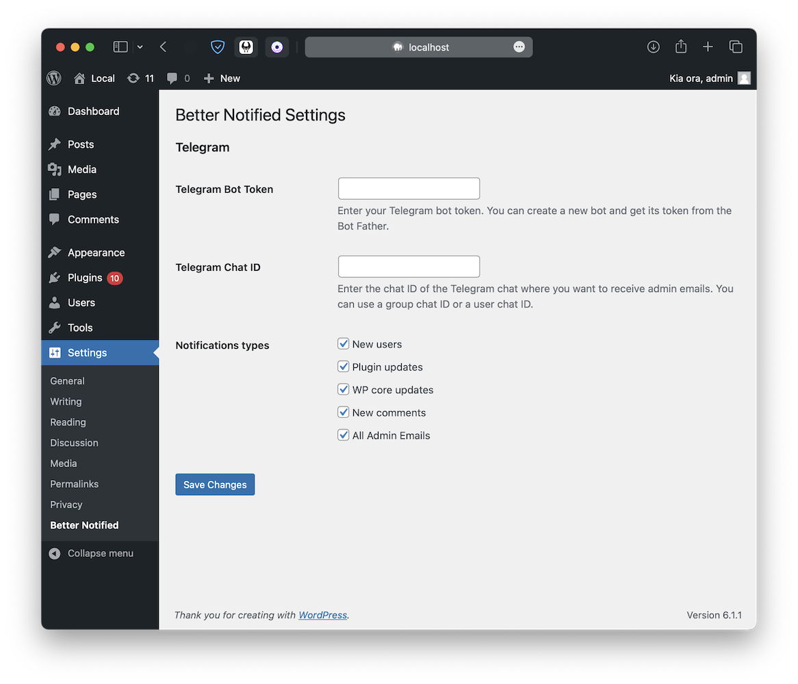

# Better-Notified 🔔

A Wordpress plugin to keep you notified of the important things.

Please note this is my first plugin for wordpress and i am new to PHP.

Screenshot_1.png

    

## To Do List

🔲 Create a multisite instance

## Complete

⬛️ Add options in settings to disable and enable each notification type.
⬛️ Seperate out the single PHP file into different files such as a setting.php

Plugin Update Checker is being used to push updates.
